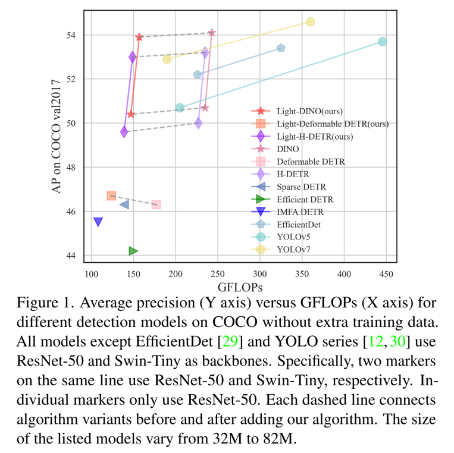
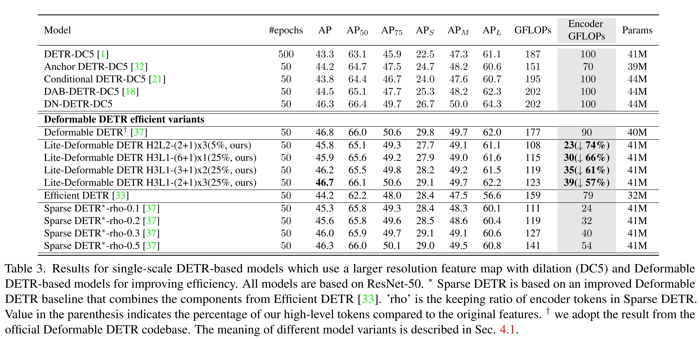
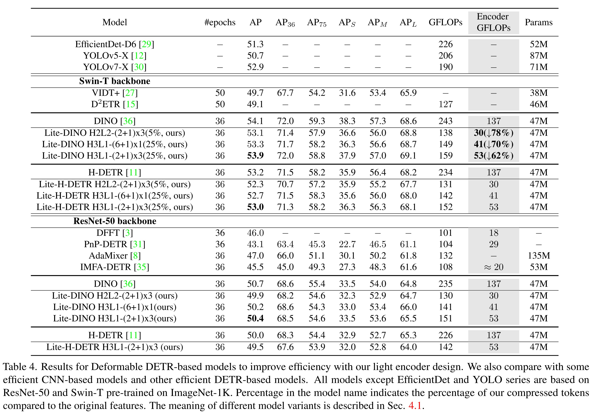

# Lite-DETR
This is the official implementation of the paper "[Lite DETR : An Interleaved Multi-Scale Encoder for Efficient DETR](https://arxiv.org/pdf/2303.07335.pdf)". Accepted to CVPR 2023.

Code will be released soon.
# Key Features
Efficient encoder design to reduce computational cost
- **Simple**. Dozens of lines code change (if not consider pluggable key-aware attention). 
- **Effective**. Reduce encoder cost by 50\% while preserve most of the original performance.
- **General**. Validated on a series of DETR models (Deformable DETR, H-DETR, DINO).


# Model Framework

# Results
Results on Deformable DETR

Results on DINO and H-DETR


## Citing Lite DETR
If you find our work helpful for your research, please consider citing the following BibTeX entry.

```BibTeX
@article{li2023lite,
  title={Lite DETR: An Interleaved Multi-Scale Encoder for Efficient DETR},
  author={Li, Feng and Zeng, Ailing and Liu, Shilong and Zhang, Hao and Li, Hongyang and Zhang, Lei and Ni, Lionel M},
  journal={arXiv preprint arXiv:2303.07335},
  year={2023}
}
```
