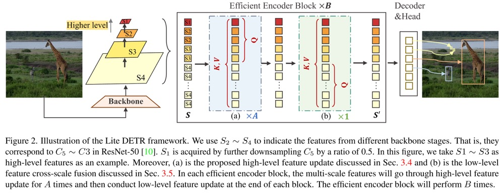

# Lite-DETR
This is the official implementation of the paper "[Lite DETR : An Interleaved Multi-Scale Encoder for Efficient DETR](https://arxiv.org/pdf/2303.07335.pdf)". Accepted to CVPR 2023.

Code is available now.
# Key Features
Efficient encoder design to reduce computational cost
- **Simple**. Dozens of lines code change (if not consider pluggable key-aware attention). 
- **Effective**. Reduce encoder cost by 50\% while preserve most of the original performance.
- **General**. Validated on a series of DETR models (Deformable DETR, H-DETR, DINO).

[comment]: <> (![hero_figure]&#40;figs/flops.png&#41;)
# Getting Started
### Lite-DINO Resnet-50 Results
<table>
  <thead>
    <tr style="text-align: right;">
      <th></th>
      <th>name</th>
      <th>backbone</th>
      <th>box AP</th>
      <th>Checkpoint</th>
    </tr>
  </thead>
  <tbody>
    <tr>
      <th>1</th>
      <td>Lite-DINO-H2L2-(2+1)x3</td>
      <td>R50</td>
      <td>49.9</td>
      <td><a href="https://github.com/IDEA-Research/Lite-DETR/releases/download/litedetr/r50_s2ex3_49.9.pth">Link</a></td>
    </tr>  
    <tr>
      <th>2</th>
      <td>Lite-DINO-H3L1-(6+1)x1</td>
      <td>R50</td>
      <td>50.2</td>
      <td><a href="https://github.com/IDEA-Research/Lite-DETR/releases/download/litedetr/r50_s3ex1_50.2.pth">Link</a></td>
    </tr>  
    <tr>
      <th>3</th>
      <td>Lite-DINO-H3L1-(2+1)x3</td>
      <td>R50</td>
      <td>50.4</td>
      <td><a href="https://github.com/IDEA-Research/Lite-DETR/releases/download/litedetr/r50_s3ex3_50.4.pth">Link</a></td>
    </tr> 
</tbody>
</table>

## Installation
We use the environment same to DINO to run Lite-DINO. If you have run DINO, you can skip this step.
We test our models under ```python=3.7.3,pytorch=1.9.0,cuda=11.1```. Other versions might be available as well.

1. Clone this repo
```sh
git https://github.com/IDEA-Research/Lite-DETR
cd Lite-DETR
```

2. Install Pytorch and torchvision

Follow the instruction on https://pytorch.org/get-started/locally/.
```sh
# an example:
conda install -c pytorch pytorch torchvision
```

3. Install other needed packages
```sh
pip install -r requirements.txt
```

4. Compiling CUDA operators
```sh
cd models/dino/ops
python setup.py build install
# unit test (should see all checking is True)
python test.py
cd ../../..
```

## Data
Please download [COCO 2017](https://cocodataset.org/) dataset and organize them as following:
```
COCODIR/
  ├── train2017/
  ├── val2017/
  └── annotations/
  	├── instances_train2017.json
  	└── instances_val2017.json
```

### Eval our pretrianed model
Download our DINO model checkpoint links in above table and perform the command below. 

```sh
python -m torch.distributed.launch main.py \
    --eval -c config/DINO/DINO_4scale.py --coco_path /path/to/your/COCODIR \
    --options num_expansion=a enc_scale=b --resume /path/to/ckpt
```
Note:
for Lite-DINO-H2L2-(2+1)x3, a=3, b=1.

for Lite-DINO-H3L1-(6+1)x1, a=1, b=3.

for Lite-DINO-H2L2-(3+1)x3, a=3, b=3.

Add `--benchmark --benchmark_only` at the end of the above command to measure the GFLOPs.
### Lack Speed Optimizations
We did not provide cuda implementation for the key-aware deformable attention (KAD), so the training and inference speed is slow. As KDA mainly impacts the performance of small objects, you can use the original deformable attention instead by setting `key_aware=False` in the config. The overall performance will be not significantly impacted.

Concurrent work [RT-DETR](https://arxiv.org/pdf/2304.08069.pdf) also adopts similar idea to handle high-resolution maps and other speed improvements. It is optimized well in running speed, so **we encourage you to use RT-DETR for practical scenarios**.

### Train the model
You can also train our model on a single process:
```sh
python -m torch.distributed.launch main.py \
    -c config/DINO/DINO_4scale.py --coco_path /path/to/your/COCODIR \
    --options num_expansion=a enc_scale=b
```
### Distributed Run
However, as the training is time consuming, we suggest to train the model on multi-gpu.
```sh
python -m torch.distributed.launch --nproc_per_node=8 main.py \
    -c config/DINO/DINO_4scale.py --coco_path /path/to/your/COCODIR \
    --options num_expansion=a enc_scale=b
```

# Model Framework


[comment]: <> (# Results)

[comment]: <> (Results on Deformable DETR)

[comment]: <> (![hero_figure]&#40;figs/deformable.jpg&#41;)

[comment]: <> (Results on DINO and H-DETR)

[comment]: <> (![hero_figure]&#40;figs/results.jpg&#41;)


## Citing Lite DETR
If you find our work helpful for your research, please consider citing the following BibTeX entry.

```BibTeX
@article{li2023lite,
  title={Lite DETR: An Interleaved Multi-Scale Encoder for Efficient DETR},
  author={Li, Feng and Zeng, Ailing and Liu, Shilong and Zhang, Hao and Li, Hongyang and Zhang, Lei and Ni, Lionel M},
  journal={arXiv preprint arXiv:2303.07335},
  year={2023}
}
```
